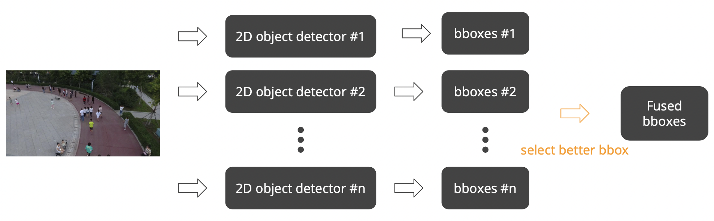

# DIP_Final

This is the implementation of the final project, "Multiple Objects Detection in Aerial Images," for the NTU 2022 Fall Digital Image Processing (DIP) course.

## Analysis

Based on the pros and cons analysis of all 2D object detection models, we discovered that different models excel in different tasks. For example, BBAVectors perform well in predicting ships, vehicles, and densely packed objects. Conversely, YOLOv7 and FCOS are adept at predicting people, benches, and categories less frequent in aerial image datasets.

As a solution, we employed late-fusion techniques to merge bounding boxes at the decision level, enhancing overall performance. The figure below illustrates the framework of the late-fusion model ensembling technique. Note: In terms of score fusion, we utilized Non-Maximum Suppression (NMS) and probabilistic ensembling (ProbEn). For bounding box fusion, we applied Non-Maximum Suppression (NMS), averaging, and weighted sum.



## Installation

```shell
conda create --name dip python==3.6
conda activate dip

conda install ipython
# For FCOS
conda install pytorch torchvision cudatoolkit=10.2 -c pytorch
# For M2Det & yolov7
conda install pytorch==0.4.1 torchvision -c pytorch

pip install -r requirements.txt

cd cocoapi/PythonAPI
python setup.py build_ext install

cd FCOS
python setup.py build develop --no-deps

cd M2Det
sh make.sh
```

## Acknowledgments

Our project is built upon the following codebases:

1. https://github.com/VDIGPKU/M2Det
2. https://github.com/WongKinYiu/yolov7
3. https://github.com/tianzhi0549/FCOS
4. https://github.com/cocodataset/cocoapi
5. https://github.com/yijingru/BBAVectors-Oriented-Object-Detection
6. https://github.com/Jamie725/Multimodal-Object-Detection-via-Probabilistic-Ensembling